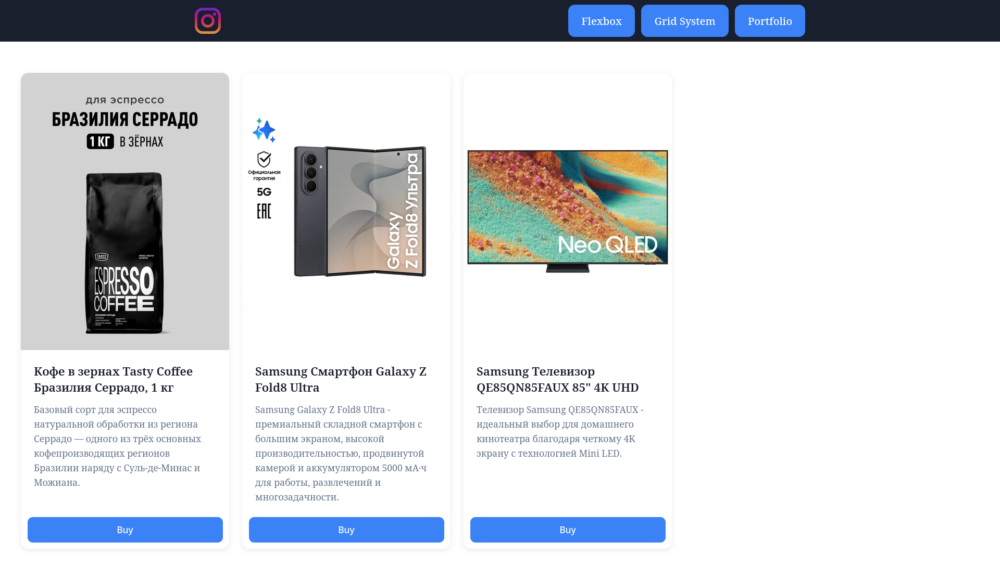
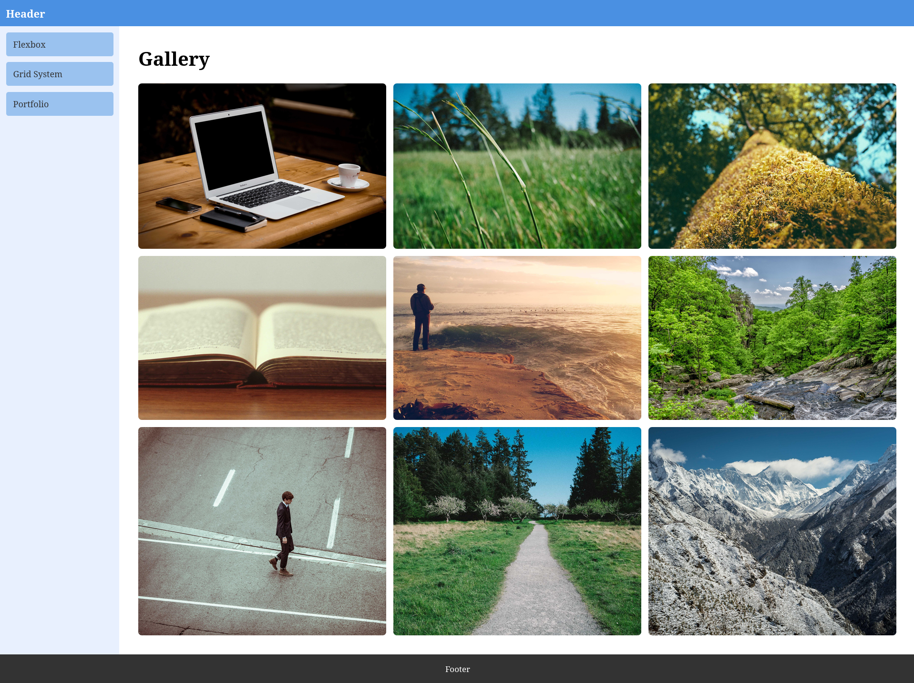
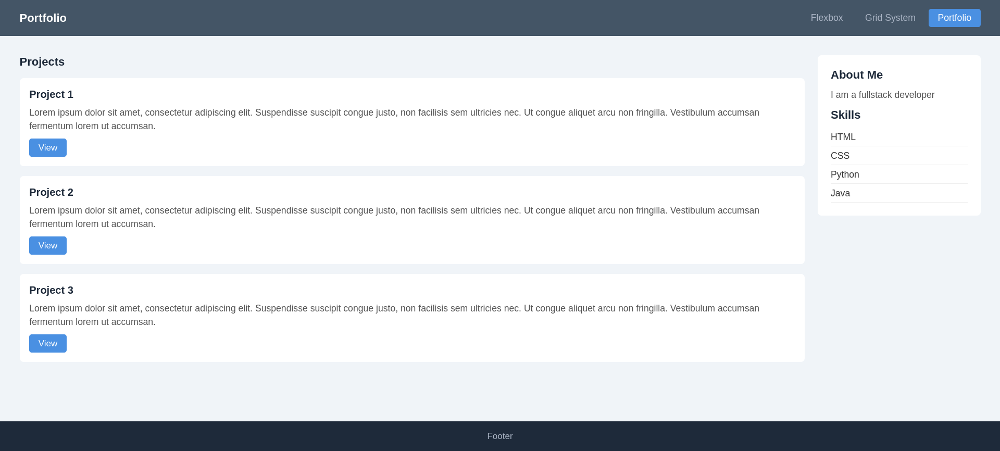

# Assignment 2 - Flexbox & Grid

**Name:** Ilya Koval
**Group:** SE-2539

## Part 1
### Task 0. Navigation Bar
I created a header with a logo on the left, and links on the right. I used flexbox for layout and put logo and links in a single flex container so they are on the same line. To make the links evenly spaced I added a gap between them.

### Task 1. Card Row
Created a row of three product cards (coffee, smartphone, TV) with images, titles, descriptions and a Buy button. Cards are placed in a flex layout to form a row, taking equal height and having a gap between them. A hover effect is applied for each card. 

## Part 2. Grid System 
### Task 2. Page Layout with Grid Areas
Created a page layout with a grid system using the grid-template-areas property. The page has four areas: header (takes the full width), sidebar (200px), main (takes the remaining width) and footer (takes the full width). The grid has three rows with heights set to auto, 1fr and auto.

### Task 3. Image Gallery
Placed 9 images in a gallery using a CSS grid with 3 column widths. Added a hover effect that increases the image size and displays a caption.

## Part 3. Combining Flexbox & Grid
### Task 4. Portfolio Page
A portfolio page that uses Flexbox and Grid together. For the header, Flexbox was used to position the navigation items, and for the main content - CSS Grid was used to divide the project cards and the sidebar into two columns. Flexbox was also used to position the elements vertically within each project card.

## Summary
In this assignment, I practiced working with Flexbox and CSS Grid, and managed to create several layouts without relying on external CSS frameworks. In particular, I used Flexbox to layout the navbar and card rows, Grid to layout the page and image gallery, and combined the two for the portfolio page. The most challenging part of the assignment was to match the CSS class names to the corresponding grid-area values.

## Link to the website
https://anommanager.github.io/web-assignment2/

